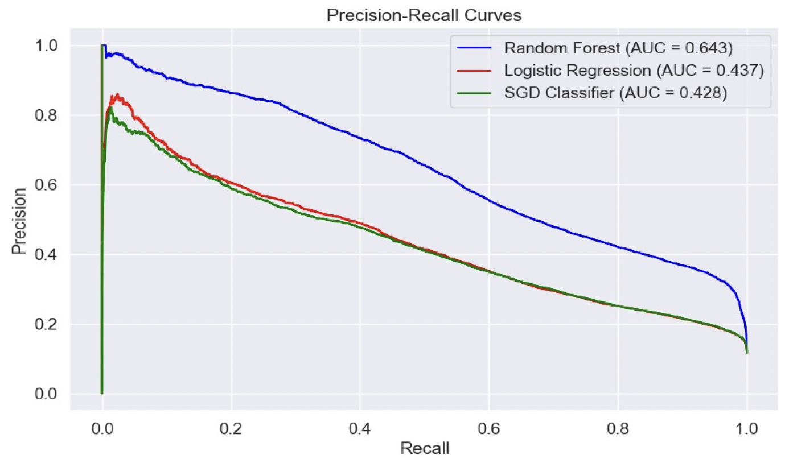
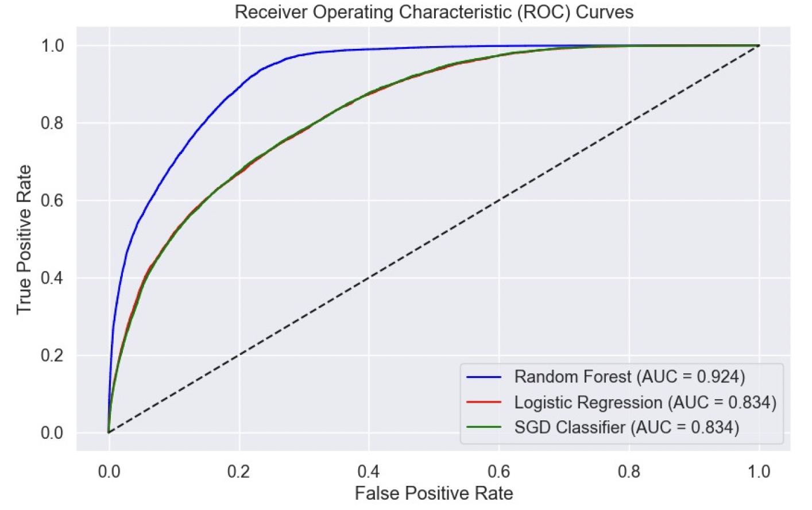

# Substance-Use-Prediction-and-Pattern-Analysis

## Overview

This project focuses on analyzing patterns and predicting substance use using both unsupervised and supervised machine learning techniques. The main objectives of this project are:
- To reduce the dimensionality of the dataset using PCA.
- To apply KMeans clustering to identify distinct groups within the dataset.
- To evaluate and predict substance use patterns using classification models.

## Features
- **Dimensionality Reduction**: Utilized Principal Component Analysis (PCA) for reducing high-dimensional data into components.
- **Clustering**: KMeans clustering was applied on PCA-reduced data to uncover hidden patterns.
- **Supervised Learning**:
  - Random Forest
  - Decision Tree
  - Logistic Regression
  - K-Nearest Neighbors (KNN)
- **Data Processing**: Includes preprocessing steps such as handling missing values, encoding, and feature scaling.
- **Evaluation**: Performance metrics include accuracy, precision, recall, and F1-score for supervised models.

---

## Installation

### Prerequisites
- Ensure you have Python 3.8 or higher installed on your machine.<br/>
- [Download the dataset](https://www.samhsa.gov/data/data-we-collect/nsduh/datafiles?year=2017&data_collection=1137)

### Setup Instructions
1. Clone the repository:
   ```bash
   git clone https://github.com/SaiKathika/Substance-Use-Prediction-and-Pattern-Analysis.git
   cd Substance-Use-Prediction-and-Pattern-Analysis

2. Install the required Packages:
   ```bash
   pip install -r requirements.txt

3. Download the dataset using the above link

4. Run Supervised Models
   With Sampling
   ```bash
   python classification_with_sampling.ipynb
   ```
   Without Sampling
   ```bash
   python classification_without_sampling.ipynb
   ```

5. Run Unsupervised Models
   1. Data Processing
      ```bash
      python 1_Data_Processing.ipynb
      ```
   2. KNN Imputation (To Handle missing values)
      ```bash
      python 2_KNN_Imputation.ipynb
      ```
   3. Apply PCA and PCA with KMeans on the data
      ```bash
      python 3_PCA_KMeans.ipynb

## Results

### Supervised Learning Results

The supervised learning models were evaluated on their performance for predicting cocaine/crack usage. The following table summarizes the key metrics:

| Metric                   | Random Forest | Logistic Regression | Linear SVC |
|--------------------------|---------------|----------------------|------------|
| Overall Accuracy         | 88.53%       | 87.72%              | 87.68%     |
| Balanced Accuracy        | 62.66%       | 59.19%              | 57.63%     |
| ROC AUC                  | 0.855        | 0.819               | N/A        |
| Matthews Correlation     | 0.381        | 0.308               | 0.287      |
| Class 0 Precision        | 89.73%       | 88.85%              | 88.45%     |
| Class 0 Recall           | 97.98%       | 98.14%              | 98.65%     |
| Class 0 F1 Score         | 93.67%       | 93.26%              | 93.27%     |
| Class 1 Precision        | 67.64%       | 62.68%              | 65.56%     |
| Class 1 Recall           | 27.35%       | 20.25%              | 16.60%     |
| Class 1 F1 Score         | 38.95%       | 30.61%              | 26.49%     |

#### Insights:
- **Random Forest** emerged as the best-performing model with the highest overall accuracy of 88.53% and balanced accuracy of 62.66%.
- Models struggled with the minority class (Class 1), as seen in lower recall rates.
- Sampling strategies, such as ADASYN, improved recall rates significantly, demonstrating the importance of addressing class imbalance.

**Precision-Recall Curves (After Sampling):**


**ROC Curves (After Sampling):**


---

### Unsupervised Learning Results

#### Principal Component Analysis (PCA)
PCA was applied to reduce the dimensionality of the dataset while preserving critical variance:
- **Combined Dataset**: 8 principal components captured 47.04% variance.
- **Substance Use Subset**: 48% variance retained with 8 components.
- **Health Indicators Subset**: 46% variance retained with 8 components.
- **Demographics Subset**: 47% variance retained with 8 components.

**PCA Metrics for the Combined Dataset:**


**PCA Metrics for Substance Use Subset:**


**PCA Metrics for Health Indicators Subset:**


**PCA Metrics for Demographics Subset:**


---

#### KMeans Clustering
KMeans clustering was implemented on PCA-reduced datasets. The number of clusters was determined using:
- **Elbow Method**
- **Silhouette Scores**

Key Metrics:
- **Silhouette Scores**: Ranged from 0.4 to 0.6, indicating moderately distinct clusters.
- **Cluster Analysis**: Identified high-risk, moderate-risk, and low-risk groups for substance use.

**KMeans Clustering Results for Combined Dataset:**


**KMeans Clustering Results for Substance Use Subset:**


**KMeans Clustering Results for Health Indicators Subset:**


**KMeans Clustering Results for Demographics Subset:**


---

### Challenges
- **Feature Interpretation**: Understanding the importance of individual features in clusters was challenging.
- **Mixed Data Types**: Handling categorical and numerical data required custom preprocessing steps.
- **Dimensionality**: Managing high-dimensional data with over 3,000 features added computational complexity.
- **Clustering Optimization**: Determining the optimal number of clusters and interpreting their significance.          
